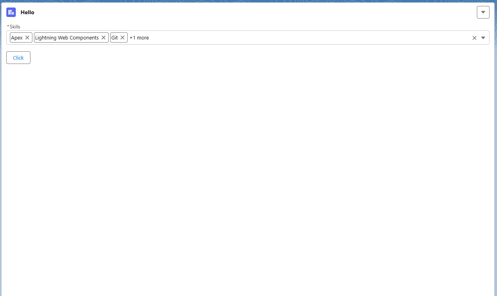

# Multi Select Combobox (LWC)

A reusable Lightning Web Component for multi-selection with checkbox dropdown, pill display, search, validation, and Salesforce-standard `checkValidity()` / `reportValidity()` APIs.

---

# Features

- Multi-select dropdown with checkbox selection
- Pill-based selected values display
- “+(n) more” collapsed display support
- Search filtering
- Select All / Clear All actions
- Required validation support
- Custom validation messages
- LWC standard validation API (`checkValidity`, `reportValidity`, `setCustomValidity`)
- Configurable dropdown height

---

# Basic Usage
```html
<c-multi-select-combobox
    label="Skills"
    options={skills}
    value={selectedSkills}>
</c-multi-select-combobox>
```
---

# API Properties

## label

Field label displayed above the combobox.
```html
label="Skills"
```
---

## options

Array of selectable options.

Example:
```javascript
[
    { label: 'Salesforce Admin', value: 'sfadmin' },
    { label: 'Platform Developer I', value: 'pd1' }
]
```
---

## value

Array of selected values.
```javascript
value={selectedSkills}
```
---

## required

Marks the field as required.
```html
required="true"
```
---

## max-displayed-values

Controls how many pills are shown before collapsing into “+X more”.
```html
max-displayed-values="3"
```
Example output:

[Admin] [Developer] [Architect] +2 more

---

## dropdown-height

Controls dropdown panel height.
```html
dropdown-height="400px"
```
or
```html
dropdown-height="min(20rem, 60vh)"
```
---

# Full Example
```html
<c-multi-select-combobox
    label="Skills"
    max-displayed-values="3"
    options={flatSkills}
    value={selectedSkills}
    required="true"
    dropdown-height="400px">
</c-multi-select-combobox>
```
---

# Events

## change event

Triggered whenever selection changes.

### Payload
```javascript
{
    value: ['sfadmin', 'pd1', 'jsdev1']
}
```
---

## Example usage
```html
<c-multi-select-combobox
    label="Skills"
    options={skills}
    value={selectedSkills}
    onchange={handleChange}>
</c-multi-select-combobox>
```
---

## JS handler
```javascript
handleChange(event) {
    this.selectedSkills = event.detail.value;
}
```
---

# Validation API

## checkValidity()

Silent validation (no UI update).
```javascript
const cmp = this.template.querySelector('c-multi-select-combobox');
const isValid = cmp.checkValidity();
```
---

## reportValidity()

Validates and shows UI error if invalid.
```javascript
const cmp = this.template.querySelector('c-multi-select-combobox');
const isValid = cmp.reportValidity();
if (!isValid) {
    return;
}
```
---

## setCustomValidity(message)

Sets a custom validation message.
```javascript
const cmp = this.template.querySelector('c-multi-select-combobox');

cmp.setCustomValidity('Please select at least 1 skill');
cmp.reportValidity();
```
---

## clearValidity()

Clears validation state.
```javascript
cmp.clearValidity();
```
---

# Submit Example
```javascript
handleSubmit() {
    const cmp = this.template.querySelector('c-multi-select-combobox');
    const isValid = cmp.reportValidity();
    if (!isValid) {
        cmp.setCustomValidity('Please select at least 1 skill');
        return;
    }
    console.log('Selected values:', cmp.value);
}
```
---

# Use Cases

- Skills selector
- Role assignment
- Tag selection
- Filters
- Multi-category selection

---

# Behavior Summary

| Feature | Supported |
|--------|----------|
| Multi-select | ✅ |
| Search | ✅ |
| Pills | ✅ |
| +(n) more | ✅ |
| Required validation | ✅ |
| Custom message | ✅ |
| LWC validation API | ✅ |
